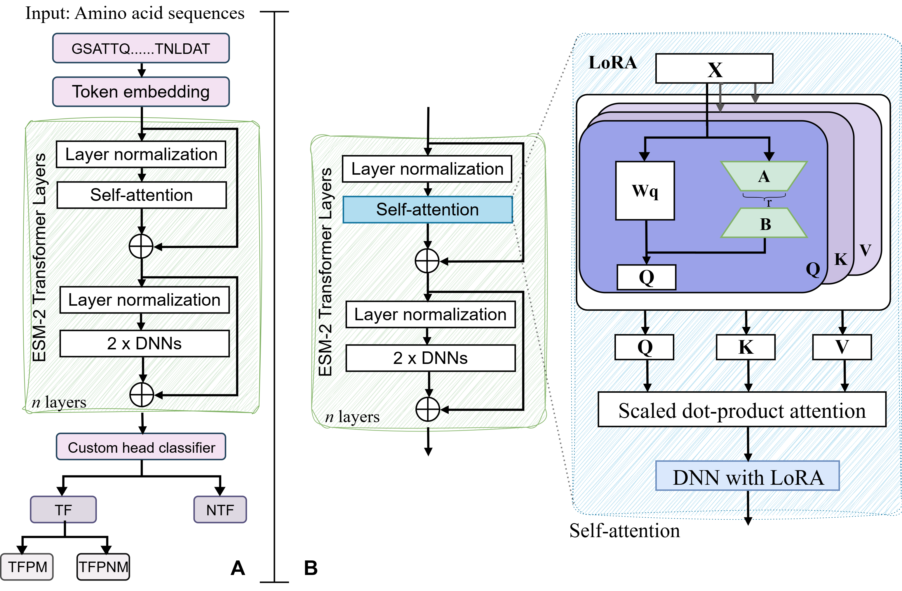
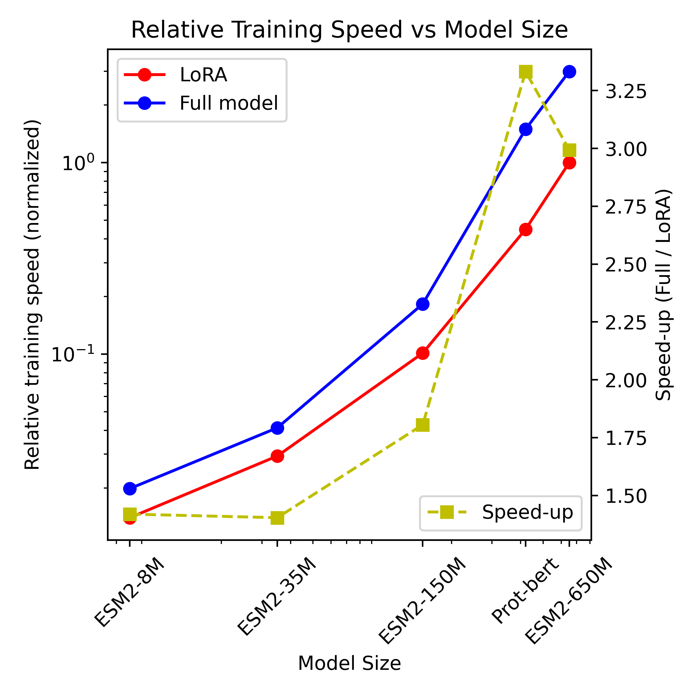

### Fine-tuned protein language models enchances the identification and interpretation of the transcription factors

Transcription factors (TFs) are key regulators of gene expression and are central to numerous cellular processes. They orchestrate transcriptional regulation and genome organization by recruiting transcriptional machinery to promoters or enhancers, thereby activating or repressing gene expression. Accurate identification of TFs is essential for understanding gene regulatory networks; however, experimental approaches are labor-intensive and time-consuming, underscoring the need for efficient computational methods.

In this study, we propose a two-layer predictive framework based on protein language models (pLMs), employing both full fine-tuning and parameter-efficient fine-tuning strategies. The first layer focuses on robust TF identification, while the second layer predicts TFs with a preference for methylated DNA (TFPMs). To enhance interpretability and predictive performance, we integrate attention weights and protein sequence motif analysis. Attention mechanisms highlight biologically relevant regions that contribute most to model predictions, while motif analysis reveals conserved sequence patterns critical for TF function. Across both TF and TFPM classification tasks, our approach consistently outperforms existing methods on independent test datasets.

### Google Colab Notebook Usage

The Google Colab notebooks are available in the **notebook folder** and can be used to retrain the model on either the provided TF dataset or your own custom data. The notebooks also support running inference directly.

For local installation or inference, please refer to the **requirements.yml** file provided in the **notebook folder**.

#### Available Notebooks

| Notebook | Description | Colab Link |
|-----------|--------------|-------------|
| **Full_Model_Fine_Tuning** | Full fine-tuning of the ESM2 models |  |
| **PEFT_Fine_Tuning_using_LoRA** | PEFT fine-tuning using LoRA technique |  |
| **Inference_using_LoRA_650M_model** | Run inference on the TF test dataset using the trained LoRA-ESM2-650M model |  |

### Model Architecture
<figure style="text-align: center;">
  
  <figcaption>
    <strong>Figure 1.</strong> Overview of the proposed two-layer pLM-based framework for transcription factor and TFPM identification using pLMs.
  </figcaption>
</figure>

### Improvement in the fine-tuned ESM2 models over pre-trained models
<figure style="text-align: center;">

  <figcaption>
    <strong>Figure 2.</strong> Improvement in the full fine-tuned and LoRA models over pre-trained models.
  </figcaption>
</figure>

### Relative speed vs model size
<figure style="text-align: center;">

  <figcaption>
    <strong>Figure 3.</strong> Comparison of training speed between full fine-tuning and LoRA, showing consistent acceleration with LoRA and an ~3× speed-up for ESM2-650M using 1024-length TF sequences.
  </figcaption>

